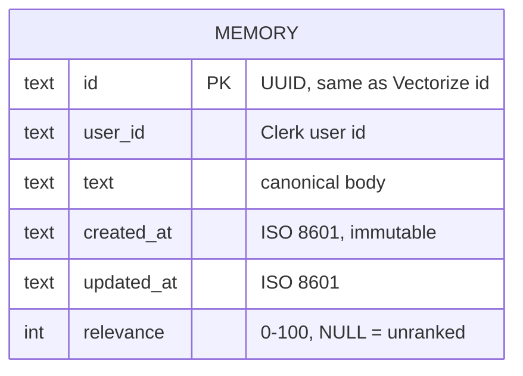
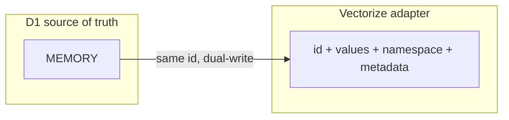

# Memory data model

Source of truth for a memory **record** is D1. Vectorize is the ANN index plus
a metadata copy so MCP `recall` still works if D1 is down.

Contract from the [admin UI grilling session](./admin-ui-grilling.md).

## ERD

Vectorize is not a SQL entity. The Cloudflare adapter stores, for the same
`id`:

| Field | Role |
| --- | --- |
| `id` | Same as `MEMORY.id` |
| `values` | Embedding from `@cf/qwen/qwen3-embedding-0.6b` |
| `namespace` | `sha256(user_id)`, **adapter-private**, not a D1 column |
| `metadata.text` | Copy of `MEMORY.text` |
| `metadata.createdAt` | Copy of `MEMORY.created_at` |
| `metadata.createdAtDay` | Epoch day, metadata index for `maxAgeDays` |

One `MEMORY` row maps to one vector. Isolation in SQL is `user_id`. Isolation
in ANN is the adapter namespace.

## Constraints

- `id` is a UUID. Admin text edit **keeps** `id`.
- `user_id` is the Clerk user id, even in this single-user server
  (`ALLOWED_USER_ID`).
- `text` is non-empty, max 2,000 characters (same cap as MCP `remember`).
- `created_at` is immutable.
- `updated_at` changes on text or relevance edit.
- `relevance` is an integer `0–100` or `NULL`. `NULL` means unranked, not
  zero. Ranking is optional and additive. Similarity (cosine) and relevance
  are different fields.
- No judgements table. Relevance is global on the memory, not per query.
- No `deleted_at`. Deletes are hard deletes in both stores.
- No session table. Admin auth is a signed cookie.

## Write paths

Order: **D1 first**, then Vectorize. If Vectorize throws, compensating D1
rollback. A D1 transaction does not include Vectorize. Not atomic.

| Action | D1 | Vectorize |
| --- | --- | --- |
| MCP `remember` | Insert row, `relevance` NULL | Upsert embedding + metadata |
| Admin text edit | Update `text`, `updated_at` | Re-embed, upsert same id. Keep `created_at` / `relevance` |
| Admin relevance edit | Update `relevance`, `updated_at` | No write |
| Admin delete | Delete row | `deleteByIds` |
| Admin create | None | None |

## Read paths

| Path | Store |
| --- | --- |
| MCP `recall` | Vectorize only. Cosine order. No `relevance` in the tool output (v1). |
| `GET /admin` | D1 list, newest first, substring filter, 50/page. |
| `GET /admin?search=` | `recallMemories` (unchanged), then D1 join by id. Show cosine and relevance. |

Read-repair (admin search only): if a vector hit has no D1 row, insert D1 from
Vectorize metadata with `relevance` NULL. Rare. Not on the MCP path.

## Appendix

- [Admin UI grilling session](./admin-ui-grilling.md) — rounds, options,
  recommendations, and settled answers that produced this model.
